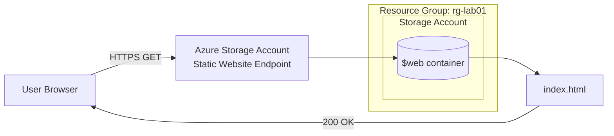

# Hosting a Static Website with Azure Blob Storage
 
## 🎬 Video Walkthrough
 
[Watch the walkthrough](<https://www.loom.com/share/d09efecbdb6c4f0a84bf8d07fc9d7819>)
 
## Project Overview
 
Deploys a static HTML site using Azure Blob Storage's built-in static website feature. No VM, no web server, no load balancer.
 
Most people's first instinct when they need to host a website is to spin up a VM and install nginx or IIS. That works, but it means patching an OS, managing a web server process, and paying for compute that sits mostly idle for a simple static page.
 
Azure Blob Storage can serve HTML, CSS, and JS directly from a `$web` container and hand you a public endpoint. No compute resource involved. This is the same pattern as **AWS S3 static website hosting**, and it's a good entry point for understanding PaaS/serverless hosting: you manage content, the cloud provider manages the infrastructure underneath it.
 
##  Skills Demonstrated
 
- Azure Portal navigation for provisioning PaaS resources
- Azure Blob Storage: static website hosting configuration, container management
- Resource Group organization and naming conventions
- Basic HTML for static content delivery
- Troubleshooting deployment issues using error messages and case-sensitivity checks
##  Architecture
 

 
No app server, no VM, no load balancer. The storage account itself serves the content. The `$web` container is auto-created when static website hosting is enabled and is the only container the endpoint reads from.
 
## Prerequisites
 
- [ ] Active Azure subscription (Free Tier works)
- [ ] Basic familiarity with the Azure Portal
- [ ] A text editor
## Naming Conventions
 
All resource names use `<yourname>` in place of a placeholder.
 
| Resource | Naming Pattern | Example |
|---|---|---|
| Resource Group | `rg-lab01-<yourname>` | `rg-lab01-kweku` |
| Storage Account | `stlab01<yourname>` | `stlab01kweku` |
| Index Document | `index.html` | `index.html` |
| Error Document | `404.html` | `404.html` |
 
Storage account names must be globally unique, lowercase, and alphanumeric only.
 
## Project Steps
 
**Step 1: Create the Resource Group**
In the Azure Portal, create a resource group named `rg-lab01-<yourname>` in your chosen region.


 
**Step 2: Create the Storage Account**
Create a storage account inside that resource group.
- Redundancy: LRS is fine for a lab. It's the cheapest tier and doesn't need geo-replication for this use case.


**Step 3: Enable Static Website Hosting**
Under *Data management*, enable static website hosting.
- Set the index document to `index.html`.
- Set an error document (`404.html`). Not required, but it avoids a raw XML error page if someone hits a bad URL.
- Azure generates a **primary endpoint URL** once you save. That's your live site address. Copy it.
[index.html](https://github.com/user-attachments/files/32713301/index.html)


**Step 4: Create the Website File**
 
Write a simple `index.html` locally.

**Step 5: Upload the File**
 
Upload `index.html` to the `$web` container that Azure auto-creates when you enable static hosting. Uploading it anywhere else silently breaks the site.


**Step 6: Validate**
 
Open the primary endpoint URL in a browser. Confirm the page loads.
 
Full step-by-step instructions with exact portal navigation are in the [lab doc](./Lab-01-Static-Website-Azure.md).

## Result
 
Deployed endpoint: `<https://stlab01kweku.z13.web.core.windows.net/>`


Note: I set the error document path to `404.html` but did not upload that file to `$web` during this run, so the custom error page was never tested. The file is included in this repo for the next deployment.
 
## Troubleshooting
Everything below actually happened during this build

| Symptom | Cause | Solution |
|---|---|---|
| Portal storage account creation failed with "Validation failed. Required information is missing or not valid." | The **Primary service** dropdown under Basics was left blank | Go back to the Basics tab, set Primary service to "Azure Blob Storage or Azure Data Lake Storage Gen 2," then retry |
| Portal upload showed only `index.html: error` with no detail | The portal hides the real reason behind a vague message | Switched to Azure CLI, which prints the actual error instead of a generic banner |
| `az: command not found` in PowerShell | Azure CLI wasn't installed yet | Installed the CLI, then closed and reopened the terminal so it picked up the updated PATH |
| `--account-name: command not found` in a WSL terminal | Backtick line continuation (`` ` ``) only works in PowerShell. This was actually a bash shell, which needs a backslash (`\`) | Rewrote the command with bash syntax and a Linux-style path (`/mnt/c/...`) |
| `az login` couldn't open a browser inside WSL | WSL has no GUI browser installed | Used `az login --use-device-code` and completed sign-in in a Windows browser |
| `[Errno 2] No such file or directory` on upload | Guessed the file's path (Desktop) instead of checking it | Used `find` to search Desktop/Downloads/Documents and located the real path in Downloads |
| "You do not have the required permissions" on upload, in both the portal and the CLI | Being the resource group's owner doesn't automatically grant data-plane access to the blobs inside a storage account, that's a separate RBAC role | Assigned myself `Storage Blob Data Contributor`, scoped to the storage account, and waited ~60 seconds for it to propagate before retrying |
| 404 on the live endpoint | File not named exactly `index.html`, or uploaded to a container other than `$web` | Confirm the filename casing and the container match exactly |
| "Storage account name is already taken" | Storage account names are unique across all of Azure, not just one subscription | Append digits to the name and retry |


##  Cleanup
 
Delete the resource group when you're done. It takes the storage account with it and stops any lingering charges.
 
```
Resource Groups → rg-lab01-<yourname> → Delete resource group
```


##  Key Takeaways
 
**PaaS means the provider owns the infrastructure, not just the hardware.** There's no server to patch or process to keep running here. Azure Blob Storage handles the request/response cycle for the site directly.
 
**Static website hosting is container-scoped, not account-scoped.** The `$web` container is the only place the endpoint reads from. Content uploaded anywhere else in the same storage account simply won't be served.
 
**Endpoints are case-sensitive.** `Index.html` will not resolve as `index.html`, even though the file otherwise exists. Small naming mismatches are the most common cause of a 404 here.
 
**Storage account names are unique across all of Azure, not just one subscription.** A "name already taken" error isn't a mistake, it's a collision with someone else's account globally.
 
---
 
**Author**: **Manuel Yannick Armah** 

**Project**: Static Website Hosting on Azure Blob Storage 

**Difficulty**: Beginner 

**Time to Complete**: 30 minutes
 
 
