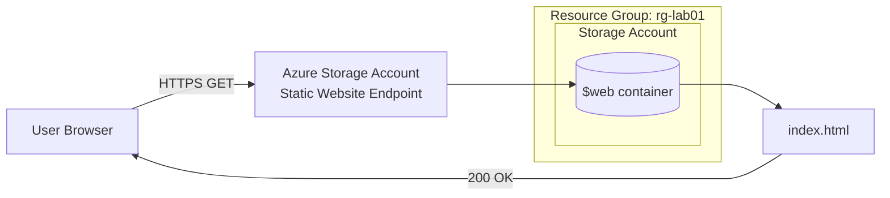

# Static Website Hosting on Azure Blob Storage
 
Status: 🚧 In progress. `<update this line to "✅ Built and deployed" once you've finished and verified it>`
 
## 🎬 Video Walkthrough
 
[Watch the walkthrough](<add your Loom link here>)
 
## Project Overview
 
Deploys a static HTML site using Azure Blob Storage's built-in static website feature. No VM, no web server, no load balancer.
 
Most people's first instinct when they need to host a website is to spin up a VM and install nginx or IIS. That works, but it means patching an OS, managing a web server process, and paying for compute that sits mostly idle for a simple static page.
 
Azure Blob Storage can serve HTML, CSS, and JS directly from a `$web` container and hand you a public endpoint. No compute resource involved. This is the same pattern as **AWS S3 static website hosting**, and it's a good entry point for understanding PaaS/serverless hosting: you manage content, the cloud provider manages the infrastructure underneath it.
 
##  Skills Demonstrated
 
- Azure Portal navigation for provisioning PaaS resources
- Azure Blob Storage: static website hosting configuration, container management
- Resource Group organization and naming conventions
- Basic HTML for static content delivery
- Troubleshooting deployment issues using error messages and case-sensitivity checks
##  Architecture
 

 
No app server, no VM, no load balancer. The storage account itself serves the content. The `$web` container is auto-created when static website hosting is enabled and is the only container the endpoint reads from.
 
## Prerequisites
 
- [ ] Active Azure subscription (Free Tier works)
- [ ] Basic familiarity with the Azure Portal
- [ ] A text editor
## Naming Conventions
 
All resource names use `<yourname>` in place of a placeholder.
 
| Resource | Naming Pattern | Example |
|---|---|---|
| Resource Group | `rg-lab01-<yourname>` | `rg-lab01-kweku` |
| Storage Account | `stlab01<yourname>` | `stlab01kweku` |
| Index Document | `index.html` | `index.html` |
| Error Document | `404.html` | `404.html` |
 
Storage account names must be globally unique, lowercase, and alphanumeric only.
 
## Project Steps
 
**Step 1: Create the Resource Group**
 
In the Azure Portal, create a resource group named `rg-lab01-<yourname>` in your chosen region.
 
**Step 2: Create the Storage Account**
 
Create a storage account inside that resource group.
- Redundancy: LRS is fine for a lab. It's the cheapest tier and doesn't need geo-replication for this use case.
**Step 3: Enable Static Website Hosting**
 
Under *Data management*, enable static website hosting.
- Set the index document to `index.html`.
- Set an error document (`404.html`). Not required, but it avoids a raw XML error page if someone hits a bad URL.
- Azure generates a **primary endpoint URL** once you save. That's your live site address. Copy it.
**Step 4: Create the Website File**
 
Write a simple `index.html` locally.
 
**Step 5: Upload the File**
 
Upload `index.html` to the `$web` container that Azure auto-creates when you enable static hosting. Uploading it anywhere else silently breaks the site.
 
**Step 6: Validate**
 
Open the primary endpoint URL in a browser. Confirm the page loads.
 
Full step-by-step instructions with exact portal navigation are in the [lab doc](./Lab-01-Static-Website-Azure.md).
 
## Result
 
Deployed endpoint: `<add your primary endpoint URL here>`
 
Screenshot: `<add a screenshot of the live page if you have one>`
 
## Troubleshooting
 
| Symptom | Cause |
|---|---|
| 404 on the endpoint | File not named exactly `index.html`, or uploaded to the wrong container |
| "Storage account name is already taken" | Name collides globally, append digits |
| Endpoint loads but shows old content | Browser cache. Hard refresh or use a private window |
 
##  Cleanup
 
Delete the resource group when you're done. It takes the storage account with it and stops any lingering charges.
 
```
Resource Groups → rg-lab01-<yourname> → Delete resource group
```
 
##  Key Takeaways
 
**PaaS means the provider owns the infrastructure, not just the hardware.** There's no server to patch or process to keep running here. Azure Blob Storage handles the request/response cycle for the site directly.
 
**Static website hosting is container-scoped, not account-scoped.** The `$web` container is the only place the endpoint reads from. Content uploaded anywhere else in the same storage account simply won't be served.
 
**Endpoints are case-sensitive.** `Index.html` will not resolve as `index.html`, even though the file otherwise exists. Small naming mismatches are the most common cause of a 404 here.
 
**Storage account names are unique across all of Azure, not just one subscription.** A "name already taken" error isn't a mistake, it's a collision with someone else's account globally.
 
---
 
**Author**: **Manuel Yannick Armah** | Project: Static Website Hosting on Azure Blob Storage | Difficulty: Beginner | Time to Complete: ~30 minutes
 
 
